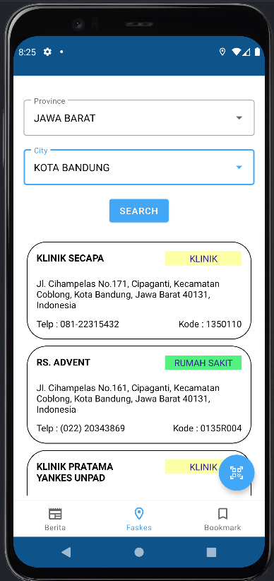
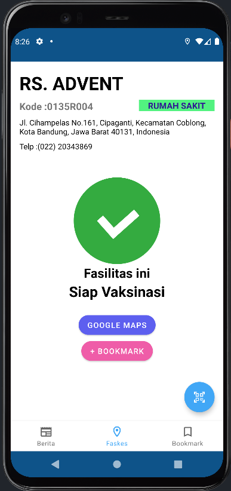
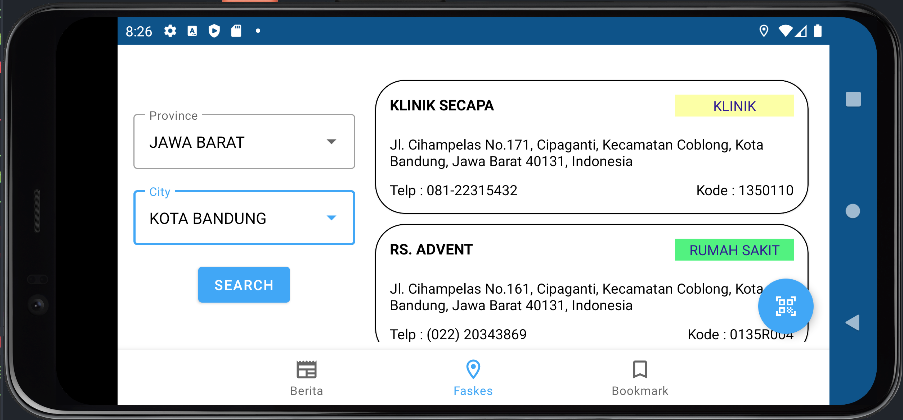
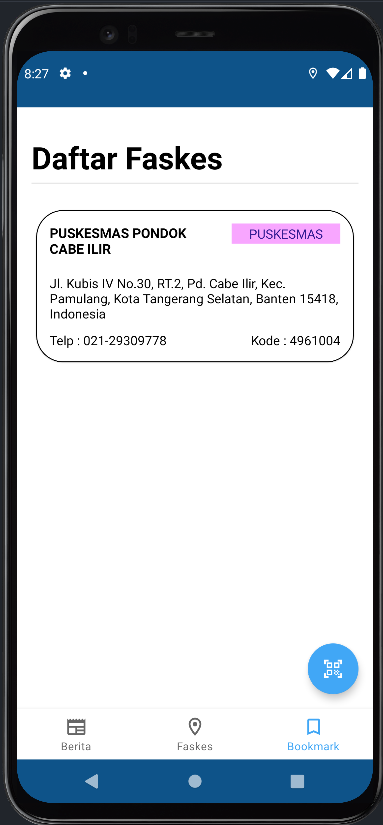
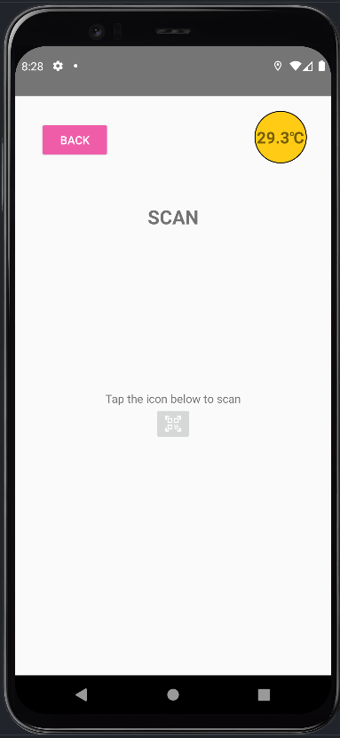

# IF3210-2022-Android-20

## Deskripsi
Aplikasi Perlu Dilindungi adalah aplikasi berbasis Android yang dibangun menggunakan bahasa Kotlin. Aplikasi ini merupakan aplikasi kesehatan yang bertujuan untuk memberikan info kesehatan kepada masyarakat khususnya di masa pandemi ini. Info tersebut berupa berita-berita terkait COVID dan daftar fasilitas kesehatan yang ada di Indonesia. Selain hal-hal tersebut, aplikasi ini juga memiliki fitur checkin yang mana penggunanya bisa masuk ke suatu tempat dengan scan QR Code yang ada.

## Cara Kerja
Aplikasi Perlu Dilindungi yang kami buat terdiri dari 5 fitur utama, antara lain:
1. Menampilkan Berita COVID-19  
Untuk melihat daftar berita COVID-19, Anda dapat menekan tombol "Berita" yang ada pada bottom navigation. 
Kemudian untuk melihat detail dari daftar berita yang ditampilkan, Anda hanya perlu menekan salah satu item pada daftar tersebut. Lalu akan tampil detail berita dari item yang Anda tekan dalam bentuk webview. 

2. Menampilkan Daftar Faskes untuk Vaksinasi  
Untuk melakukan pencarian faskes, Anda dapat menekan tombol "Faskes" yang ada pada bottom navigation. 
Pada halaman pencarian faskes ini, Anda perlu memilih provinsi dan kabupaten/kota lokasi faskes yang ingin dicari terlebih dahulu. Setelah itu, Anda dapat menekan tombol "Search" yang akan menampilkan maksimal lima daftar faskes terdekat berdasarkan lokasi yang Anda masukkan. 
Halaman daftar faskes ini memiliki layout yang responsive sehingga dapat ditampilan secara potrait maupun landscape. 

3. Menampilkan Detail Informasi Faskes  
Untuk melihat detail informasi dari faskes yang telah ditampilkan pada daftar hasil pencarian faskes, Anda hanya perlu menekan salah satu item pada daftar. Lalu akan tampil detail faskes dari item yang Anda tekan. 
Anda dapat melakukan bookmark untuk item faskes tersebut dengan menekan tombol "+BOOKMARK" ataupun melakukan un-bookmark dengan menekan tombol "-BOOKMARK" yang ada pada halaman detail faskes. 
Anda juga dapat membuka Google Maps untuk melihat lokasi faskes tersebut dengan menekan tombol "GOOGLE MAPS". 

4. Menampilkan Daftar Bookmark Faskes  
Untuk melihat daftar faskes yang sudah Anda bookmark, Anda dapat menekan tombol "Bookmark" yang ada pada bottom navigation. 
Untuk melihat detail dari faskes yang berada pada daftar bookmark ini, Anda hanya perlu menekan salah satu item yang ada pada daftar tersebut. Lalu akan tampil detail faskes dari item yang Anda tekan. 
Untuk menghapus suatu item faskes pada daftar bookmark faskes, Anda pada melakukan un-bookmark dengan menekan tombol "-BOOKMARK" yang ada pada halaman detail faskes. 

5. Melakukan "Check-In"  
Untuk melakukan check-in, Anda perlu masuk ke halaman QR Code Scanner dengan menekan floating button yang berapa pada kanan bawah layar. 
Pada halaman QR Code Scanner akan ditampilkan informasi suhu kamar pada kanan atas layar. 
Untuk melakukan scanning, Anda perlu menekan icon yang ada pada tengah layar. Lalu aplikasi akan meminta izin untuk mengakses kamera android Anda. Setelah akses diberikan, Anda hanya perlu mengarahkan kamera Anda pada QR Code yang Anda miliki. Ketika proses scanning berhasil, status Anda akan ditampilkan berdasarkan pembacaan QR Code yang telah dilakukan. Akan ditampilkan alasan jika status Anda red atau black.  

## Library
1. Retrofit (Mengambil data dari API)
2. Room (Penyimpanan SQLite secara lokal untuk Bookmark)
3. Zxing (Scan QR Code)
4. Google Material.io (Material Design)
5. Glide (Image Loader pada Daftar Berita)

## Screenshot

    Halaman Landing Page (Splash Screen)

    Halaman News

    Halaman Faskes

    Halaman Boomark

    Halaman QRCode

## Pembagian Kerja
- Juan Louis Rombetasik (13519075) : Daftar Faskes, Bookmark Faskes
- Nabila Hannania (13519097) : Landing Page (Splash Screen), Daftar Berita, Detail Berita
- Jordan Daniel Joshua (13519098) : Room, QRCode, Detail Faskes

