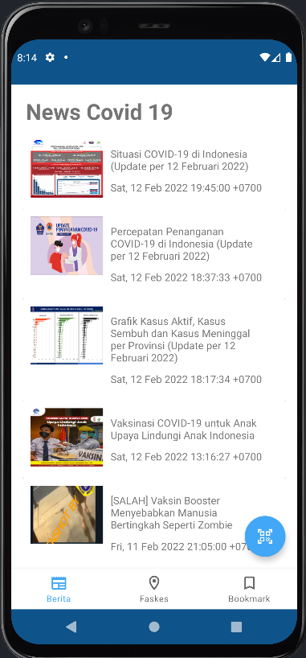
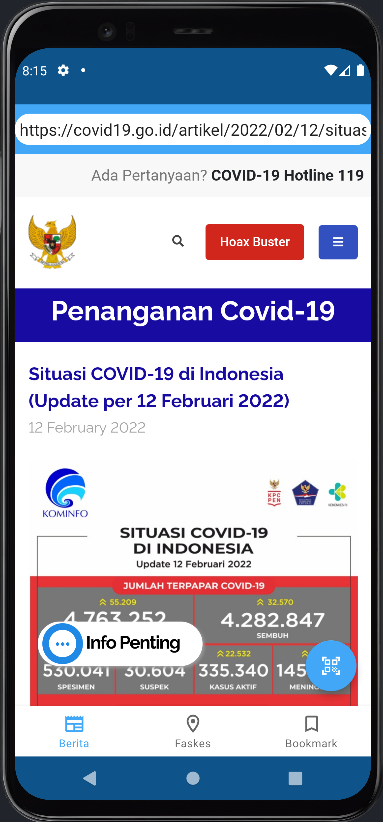
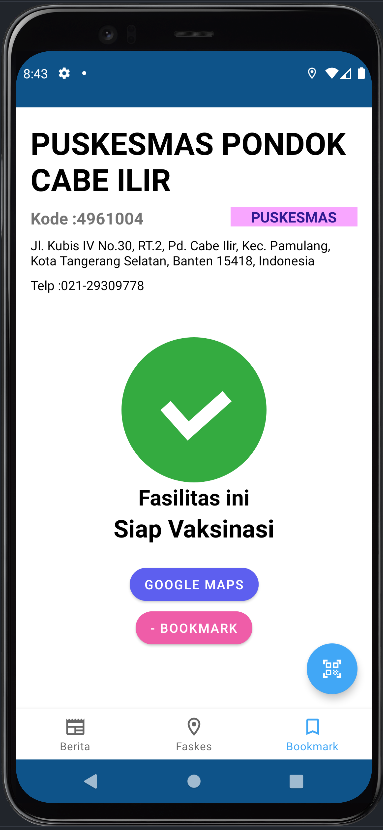
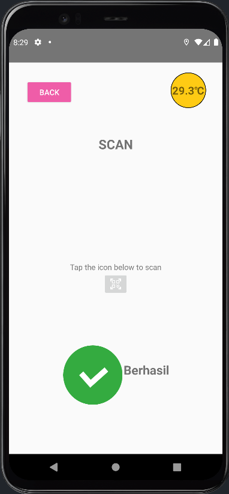
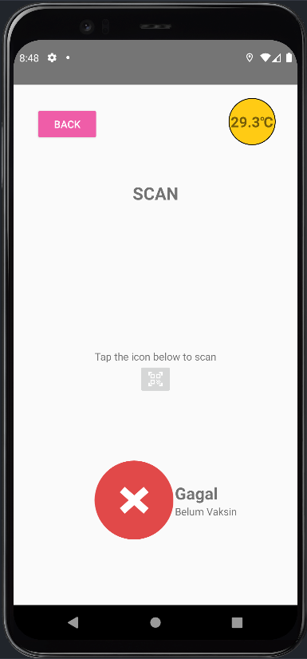

# IF3210-2022-Android-20

## Deskripsi
Aplikasi Perlu Dilindungi adalah aplikasi berbasis Android yang dibangun menggunakan bahasa Kotlin. Aplikasi ini merupakan aplikasi kesehatan yang bertujuan untuk memberikan info kesehatan kepada masyarakat khususnya di masa pandemi ini. Info tersebut berupa berita-berita terkait COVID dan daftar fasilitas kesehatan yang ada di Indonesia. Selain hal-hal tersebut, aplikasi ini juga memiliki fitur checkin yang mana penggunanya bisa masuk ke suatu tempat dengan scan QR Code yang ada.

## Cara Kerja

## Library
1. Retrofit (Mengambil data dari API)
2. Room (Penyimpanan SQLite secara lokal untuk Bookmark)
3. Zxing (Scan QR Code)
4. Google Material.io (Material Design)

## Screenshot

    Halaman Splash Screen

    Halaman News

    Halaman Faskes

    Halaman Boomark

    Halaman QRCode

## Pembagian Kerja
- Juan Louis Rombetasik (13519075) : Daftar Faskes, Bookmark Faskes
- Nabila Hannania (13519097) :
- Jordan Daniel Joshua (13519098) : Room, QRCode, Detail Faskes

